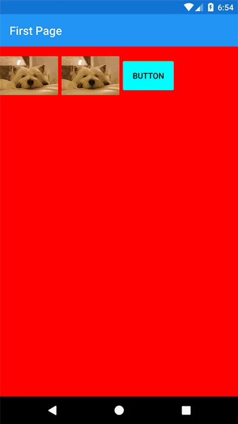
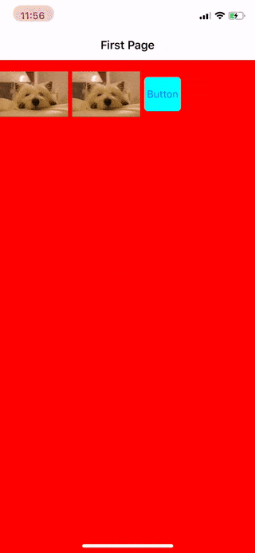

##  Xamarin.Plugin.SharedTransitions
Activate shared element transitions between pages in Xamarin.Forms (IOS/Android)

[](https://www.nuget.org/packages/Xamarin.Plugin.SharedTransitions/)  [](https://opensource.org/licenses/MIT)


#### What is a shared element transition?
They are Animations connecting common elements from one page to the next/previous.<br>
A shared element transition determines how elements that are present in two pages transition between them.
For example, an image that is displayed on both Page A and Page B, transitions from A to B when B becomes visible.
Transitions in apps provide visual continuity, connecting common elements from one page to the next.


&nbsp;&nbsp;&nbsp;&nbsp;&nbsp;&nbsp;

## Setup

* [Available on Nuget](https://www.nuget.org/packages/Xamarin.Plugin.SharedTransitions/)  [](https://www.nuget.org/packages/Xamarin.Plugin.SharedTransitions/)
* Install into your NetStandard project and Client projects.

**Platform Support**

|Platform|Version|
| -------------------  | :------------------: |
|Xamarin.iOS|iOS 9+|
|Xamarin.Android|API 21+|

## Usage


To activate transitions between pages, use the *SharedTransitionNavigationPage* instead the classic *NavigationPage*:
```csharp
MainPage = new SharedTransitionNavigationPage(new Page1());
```

Add the xmlns namespace in your pages:
```
xmlns:sharedTransitions="clr-namespace:Plugin.SharedTransitions;assembly=Plugin.SharedTransitions"
```

#### Basic shared transitions with fixed elements

This is the most basic type of transitions. We are going to animate one or more views from Page1 to Page2.

Tag the views to transition in the **source page**, for example *Page1.xaml*: 

```xml
<Image Source="mydog.jpg" sharedTransitions:Transition.Tag="1" WidthRequest="100" />
```

Tag the views to transition in the **destination page**, for example *Page2.xaml*: 

```xml
<Image Source="mydog.jpg" sharedTransitions:Transition.Tag="1"  WidthRequest="300" />
```

Now from Page1 you can push Page2 to start the transition:

```csharp
 NavigationPage.Push(new Page2())
```

When doing a Pop prom Page2 to Page1 a return transition will occour


#### Advanced shared transitions between collection of views and their details page

This type of shared transition is useful to animate a selected item from a collection of views (for example a listview or any custom control with bindable views) to his "details" page.
To make this work we need to set the *Transition.TagGroup*

Listview sample in the **source page**, binding the TagGroup to a unique integer. The Tag property is used the same as the basic shared transition example.

```xml
<ListView HasUnevenRows="True">  
    <ListView.ItemTemplate>  
        <DataTemplate>  
            <ViewCell>  
                <StackLayout Orientation="Horizontal">  
                    <Label Text="{Binding Name}" Font="18"/>
                    <Image  Source="{Binding imgsource}" 
                            HorizontalOptions="EndAndExpand"
                            HeightRequest="30" WidthRequest="50"
                            sharedTransitions:Transition.Tag="1" 
                            sharedTransitions:Transition.TagGroup="{Binding Id}" />
                </StackLayout>  
            </ViewCell>  
        </DataTemplate>  
    </ListView.ItemTemplate>  
</ListView>  
```

Tag the views to transition in the **destination page**, for example *Page2.xaml*. We dont have to specify the TagGroup in the destination page, the match between pages will occour with the Tag property.

```xml
<Image x:Name="detailImage" sharedTransitions:Transition.Tag="1" WidthRequest="300" />
```

When navigating from the source listview page to the destination you need to inform the NavigationPage of what TagGroup has been selected using:

 ```csharp
 private async void MyItemTapped(object sender,  ItemTapEventArgs e)
{
    var content = e.Item as MyModel;
   //this is required in order to pass the views to animate
    SharedTransitionNavigationPage.SetSelectedTagGroup(this, content.Id);
    await Navigation.PushAsync(new Page2(content));
}
```

Now in the destination page you have to read the selected element and set the Source for the *detailImage* based on the selected item

#### SharedNavigationPage methods

For every setter specified here, we have the corrisponding getter

```csharp
// Sets the selected tag group for this page
public static void SetSelectedTagGroup(Page page, int value)

// Sets the duration of the shared transition for this page (in ms).
public static void SetSharedTransitionDuration(Page page, long value)

// Sets the background animation for this page. 
// This is applied to also to all the views not included in the shared transition
public static void SetBackgroundAnimation(Page page, BackgroundAnimation value)
```

Background animations provided:

```csharp
// Background Animation Type
public enum BackgroundAnimation
{
    // Do not animate.
    None,
    // Show a fade animation.
    Fade
}
```

## Important notes
* The *Transition.Tag* and *Transition.TagGroup* are integer numbers
* The *Transition.Tag* in source and destination page needs to match in order to display the animated transition
* You can animate multiple views at once, just remember that every tag in a page needs to be unique
* You can animate the same element in multiple, subsequent pages
* On IOS you can pop the page using a PanGesture on the left side of the screen

## Coming soon
* More examples in the sample app (currently missing the advanced navigation example)
* More background animations (flip, scale, slide from left left, right, top, bottom)
* Support for other navigation containers (I have to do some research for this)

## Copyright and license

Code released under the [MIT license](https://opensource.org/licenses/MIT),  [see license file](https://github.com/Evolutionlab/Xamarin.Plugin.SharedTransitions/blob/master/LICENSE).