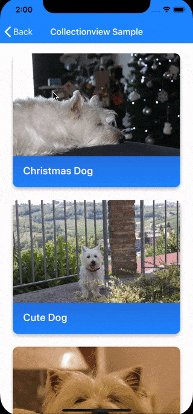
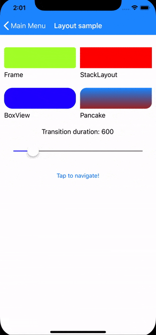

##  Xamarin.Plugin.SharedTransitions
Activate shared element transitions between pages in Xamarin.Forms (IOS/Android)

[](https://www.nuget.org/packages/Xamarin.Plugin.SharedTransitions/)  [](https://opensource.org/licenses/MIT)


#### What is a shared element transition?
Shared element transitions are animations connecting common elements from one page to another.<br>
A shared element transition determines how elements that are present in two pages transition between them.
For example, an image that is displayed on both Page A and Page B, transitions from A to B when B becomes visible.

&nbsp;&nbsp;&nbsp;&nbsp;&nbsp;&nbsp;

## Setup

* [Available on Nuget](https://www.nuget.org/packages/Xamarin.Plugin.SharedTransitions/)  [](https://www.nuget.org/packages/Xamarin.Plugin.SharedTransitions/)
* Install into your NetStandard project and Platforms projects.

**Platform Support**

|Platform|Version|
| -------------------  | :------------------: |
|Xamarin.iOS|iOS 9+|
|Xamarin.Android|API 21+|

## Please note:

Starting from version 2, attached properties have been renamed to: ```Transition.Name```, ```Transition.Group``` and ```TransitionDuration```.
**This is a Breaking change!**

The new [sample app](https://github.com/Evolutionlab/Xamarin.Plugin.SharedTransitions/tree/master/src/Sample/TransitionApp) include everything you need to play with this plugin. 
Btw, I recommend to read all this page, expecially the few Android limitations.

## Usage


To activate transitions between pages, use the ```SharedTransitionNavigationPage``` instead of the classic NavigationPage:
```csharp
MainPage = new SharedTransitionNavigationPage(new Page1());
```

Add the xmlns namespace in your pages:
```xml
xmlns:sharedTransitions="clr-namespace:Plugin.SharedTransitions;assembly=Plugin.SharedTransitions"
```

### Basic shared transitions with fixed elements

This is the most basic type of transition. We are going to animate one or more views from Page1 to Page2.

Tag the views to transition in the **source page** (Page1): 

```xml
<Image Source="mydog.jpg" sharedTransitions:Transition.Name="dogtransition" WidthRequest="100" />
```

Tag the views to transition in the **destination page** (Page2), using the same transition name: 

```xml
<Image Source="mydog.jpg" sharedTransitions:Transition.Name="dogtransition"  WidthRequest="300" />
```

Now you can start the transition doing a standard push between pages:

```csharp
 NavigationPage.Push(new Page2())
```

When doing a Pop from Page2 to Page1 a return transition will occour


### Advanced shared transitions between collection of views and their details page

This type of shared transition is useful to animate a selected item from a collection of views (for example a listview or any custom control with bindable views) to his "details" page.
To make this work we need to set the ```sharedTransitions:Transition.Group``` property. It can be a number or a string and *MUST* to be unique for every List Item.

#### Listview sample:

Bind the ```Transition.Group``` to a unique value in the **source page** . The ```Transition.Name``` property is used as usual to identify the views to transition.

```xml
<ListView Footer="" ItemsSource="{Binding Dogs}" HasUnevenRows="True" SelectionMode="None">
    <ListView.ItemTemplate>
        <DataTemplate>
            <ViewCell>
                <StackLayout Orientation="Horizontal">
                    <Image Source="{Binding Image}" WidthRequest="100" Margin="0,8"
                            sharedTransitions:Transition.Name="DogImage"
                            sharedTransitions:Transition.Group="{Binding Id}"/>
                    <Label Text="{Binding Title}" VerticalOptions="Center" />
                </StackLayout>
            </ViewCell>
        </DataTemplate>
    </ListView.ItemTemplate>
</ListView>
```

Then in the destination page, tag the views to transition. We dont have to specify the Transition Group in the destination page, the match between pages will occour with the ```Transition.Name``` property.

```xml
<StackLayout Spacing="20" Padding="10">
    <Image Source="{Binding SelectedDog.Image}" sharedTransitions:Transition.Name="DogImage"  />
    <Label Text="{Binding SelectedDog.Title}" HorizontalOptions="Center" FontAttributes="Bold" FontSize="Large" />
    <Label Text="{Binding SelectedDog.Description}" />
</StackLayout>
```

When navigating from the source listview page to the destination, you need to inform the NavigationPage of what Transition Group has been selected:

 ```csharp
 private async void MyItemTapped(object sender,  ItemTapEventArgs e)
{
    var tappedItemData = e.Item as MyModel;
   //this is required in order to pass the views to animate
    SharedTransitionNavigationPage.SetSelectedTransitionGroup(this, tappedItemData.Id);
    await Navigation.PushAsync(new Page3(tappedItemData));
}
```

 
#### Listview MVVM sample:

if you are using MVVM, you can bind the ```SelectedTransitionGroup``` property directly in XAML with binding:
```xml
<ContentPage .....
			 .....
			 SharedTransitionNavigationPage.SelectedGroup={Binding Selectedgroup}
```

Then, in your VM valorize the ```SelectedGroup``` property before the push. Here a full example using the ```EventToCommandBehaviour``` from [Prism](https://github.com/PrismLibrary/Prism) (you can use whaterver you want to handle the tap in your viewmodel):

```xml

<ContentPage xmlns="http://xamarin.com/schemas/2014/forms"
             xmlns:x="http://schemas.microsoft.com/winfx/2009/xaml"
             xmlns:ios="clr-namespace:Xamarin.Forms.PlatformConfiguration.iOSSpecific;assembly=Xamarin.Forms.Core"
             xmlns:sharedTransitions="clr-namespace:Plugin.SharedTransitions;assembly=Plugin.SharedTransitions"
             xmlns:prism="clr-namespace:Prism.Mvvm;assembly=Prism.Forms"
             prism:ViewModelLocator.AutowireViewModel="True" Padding="0"
             xmlns:behaviors="http://prismlibrary.com"
             x:Class="TransitionApp.Views.DynamicSampleFrom" Title="Listview sample"
             sharedTransitions:SharedTransitionNavigationPage.TransitionSelectedGroup="{Binding SelectedDogId }" >

        <ListView Footer="" ItemsSource="{Binding Dogs}" HasUnevenRows="True" SelectionMode="None">
            <ListView.Behaviors>
                <behaviors:EventToCommandBehavior EventName="ItemTapped"
                                                  Command="{Binding NavigateDogCommand}" 
                                                  EventArgsParameterPath="Item" />
            </ListView.Behaviors>
            <ListView.ItemTemplate>
                <DataTemplate>
                    <ViewCell>
                        <StackLayout Orientation="Horizontal">
                            <Image Source="{Binding Image}" WidthRequest="100" Margin="0,8"
                                   sharedTransitions:Transition.Name="DogImage"
                                   sharedTransitions:Transition.Group="{Binding Id}"/>
                            <Label Text="{Binding Title}" VerticalOptions="Center" />
                        </StackLayout>
                    </ViewCell>
                </DataTemplate>
            </ListView.ItemTemplate>
        </ListView>
</ContentPage>
```

**The ViewModel:**

 ```csharp
 public class DynamicSampleFromViewModel : ViewModelBase
    {
        private List<DogModel> _dogs;
        public List<DogModel> Dogs
        {
            get { return _dogs; }
            set { SetProperty(ref _dogs, value); }
        }

        private int _selectedDogId;
        public int SelectedDogId
        {
            get { return _selectedDogId; }
            set { SetProperty(ref _selectedDogId, value); }
        }

        public DelegateCommand<DogModel> NavigateDogCommand { get; set; }

        public DynamicSampleFromViewModel(INavigationService navigationService) : base(navigationService)
        {
            NavigateDogCommand = new DelegateCommand<DogModel>(async (selectedDog) =>
            {
               SelectedDogId = selectedDog.Id;
               
               var navParam = new NavigationParameters {{nameof(selectedDog), selectedDog}}; 
               await navigationService.NavigateAsync($"{nameof(DynamicSampleTo)}",navParam);
            });
        }

        public override void OnNavigatedTo(INavigationParameters parameters)
        {
            base.OnNavigatedTo(parameters);

            if (parameters.GetNavigationMode() != NavigationMode.Back)
            {
                var description = "Lorem ipsum dolor sit amet, consectetur adipiscing elit, sed do eiusmod tempor incididunt ut labore et dolore magna aliqua. Ut enim ad minim veniam, quis nostrud exercitation ullamco laboris nisi ut aliquip ex ea commodo consequat. Duis aute irure dolor in reprehenderit in voluptate velit esse cillum dolore eu fugiat nulla pariatur. Excepteur sint occaecat cupidatat non proident, sunt in culpa qui officia deserunt mollit anim id est laborum.";
                Dogs = new List<DogModel>
                {
                    new DogModel {Id =1, Title = "Christmas Dog",    Image = "christmas_dog.jpg", Description = description},
                    new DogModel {Id =2, Title = "Cute Dog",         Image = "cute_dog.jpg",      Description = description},
                    new DogModel {Id =3, Title = "Lazy Dog",         Image = "lazy_dog.jpg",      Description = description},
                    new DogModel {Id =4, Title = "What the Dog??!?", Image = "what_the_dog.jpg",  Description = description},
                };
            }

        }
    }
```

**Destination page**

In the destination page, you have to just set the Transition Name property to display the animation:

```xml
<StackLayout Spacing="20" Padding="10">
    <Image Source="{Binding SelectedDog.Image}" sharedTransitions:Transition.Name="DogImage"  />
    <Label Text="{Binding SelectedDog.Title}" HorizontalOptions="Center" FontAttributes="Bold" FontSize="Large" />
    <Label Text="{Binding SelectedDog.Description}" />
</StackLayout>
```

Everything is in the [sample app](https://github.com/Evolutionlab/Xamarin.Plugin.SharedTransitions/tree/master/src/Sample/TransitionApp), go take a look at it :)

## Transition attached properties

|Bindable property|Description|
| -------------------  | ------------------ |
|```Transition.Name```|The name of the transition used to associate viewvs between pages|
|```Transition.Group```|The unique group used to associate transition groups in dynamic lists|

## SharedNavigationPage properties

|Bindable property|Description|
| -------------------  | ------------------ |
|```SelectedTransitionGroup```|The selected ```Transition.Group``` used for dynamic transitions|
|```SharedTransitionDuration```|Duration, in ms, of the shared transition|
|```BackgroundAnimation```| Sets the background animation for this page. This is applied to also to all the views not included in the shared transition|

## Background animations provided:

|Background animation|Description|
| -------------------  | ------------------ |
|```None```|Do not animate|
|```Fade```|Show a fade animation|
|```Flip```|Show a flip animation|
|```SlideFromLeft```|Show a slide from left animation|
|```SlideFromRight```|Show a slide from right animation|
|```SlideFromTop```|Show a slide from top animation|
|```SlideFromBottom```|Show a slide from bottom animation|


## Important notes
* The ```sharedTransitions:Transition.Name``` in source and destination page needs to match in order to display the animated transition
* You can animate multiple views at once, just remember that every Transition Name in a page needs to be unique
* You can animate the same element in multiple, subsequent pages

## iOS Notes
* Full shape layout transition is supported (eg: different corner radius between starting and ending views)
* You can pop the page using a PanGesture on the left side of the screen

## Android Limitations
* When animating layouts (frame, stacklayouts....) **i suggest to dont use a background transition other than "Fade" (or "None")**. Android doesnt play well with background animation + shared transitions of layouts
* **Shape layout transitions are not well supported** (they play well only on pushing Frames). I suppose there is some problem with clipping, maybe we can adjust this making a custom SharedTransition callback and play with shapes & clip, but i didnt find yet a way to do this (playng with shapes & clip i mean, create a custom callback is easy). IF anyone want to help it will be SUPER-welcome!
* **The Collectionview has a strange behaviour:** when popping to the first item, if the collectionview scroll is zero the transition has some minor glitch. If we make a small scroll (even 1 pixel) everything works fine. This happens ONLY in the first item and ONLY when the scroll is 0. I'm waiting for the final collectionview and if this will persists i'll make a simple customrenderer that will set the minscroll to 1

## New Sample app!
The sample app has been completely rewritten: you can find examples for images & layouts, as well as dynamic examples (for both listview & collectionview).

The app is made with [Prism](https://github.com/PrismLibrary/Prism) and it sports the superawesome [PancakeView](https://github.com/sthewissen/Xamarin.Forms.PancakeView/) and [FFImageLoading](https://github.com/luberda-molinet/FFImageLoading) plugins!

*Note: Yes my dog is supercute and deserve her sample app :D*


## More samples!

Xamarin.Forms good looking UI [sample](https://github.com/jsuarezruiz/ArtNews) using BindableLayout and CollectionView. 


This sample is based on [Art News App](https://dribbble.com/shots/6282441-Art-News-App) designed by [Shirley Yao](https://dribbble.com/shirleyyao).

*Note: This sample use the old version of this plugin. That code will not work with the version 2.*

## Roadmap
- [ ] Fix android minor glitch in the Collectionview preview when we pop the first element and the CollectionView scroll is at 0
- [ ] Improve Android shape transitions (different corner radius)


## Latest release notes
**2.0.1**
* **BREAKING:** Properties renamed to: Transition.Name, Transition.Group and TransitionDuration 
* Full MVVM support with TransitionSelectedGroup
* New, improved Transition management under the hood (no more limitation to int number for transition names & groups, faster view lookup for transitions)
* New transition engine for ios (support for shape transitions, including boxview, images with different bounds, aspect ratios, ecc..)
* New sample app in full MVVM with listview, collectionview and normal transitions (including demostrations with PancakeView and FFImageLoading)
* Everything mostly rewritten fro the ground-up: better stability and functionality
* Improved code comments and error handling 
* Added useful notes in code to help contributors to make this plugin better!


## Copyright and license

Code released under the [MIT license](https://opensource.org/licenses/MIT),  [see license file](https://github.com/Evolutionlab/Xamarin.Plugin.SharedTransitions/blob/master/LICENSE).
